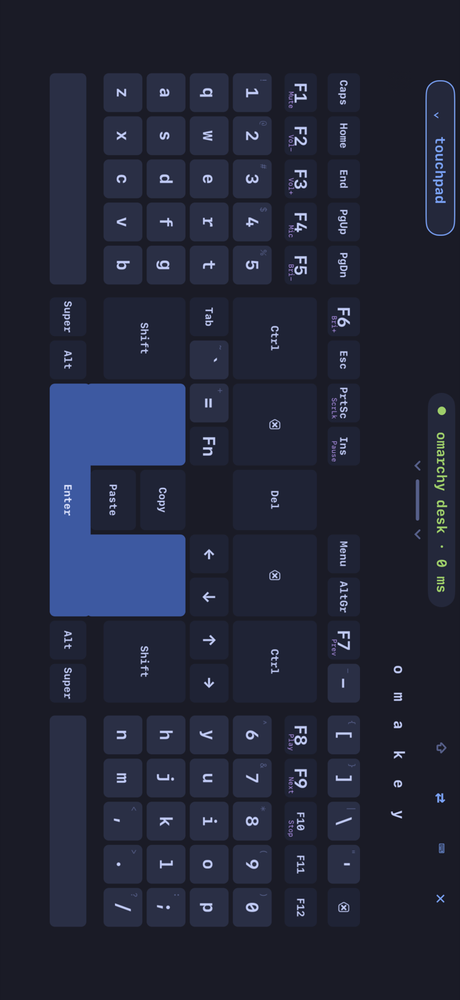
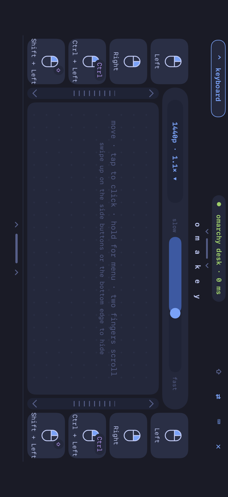
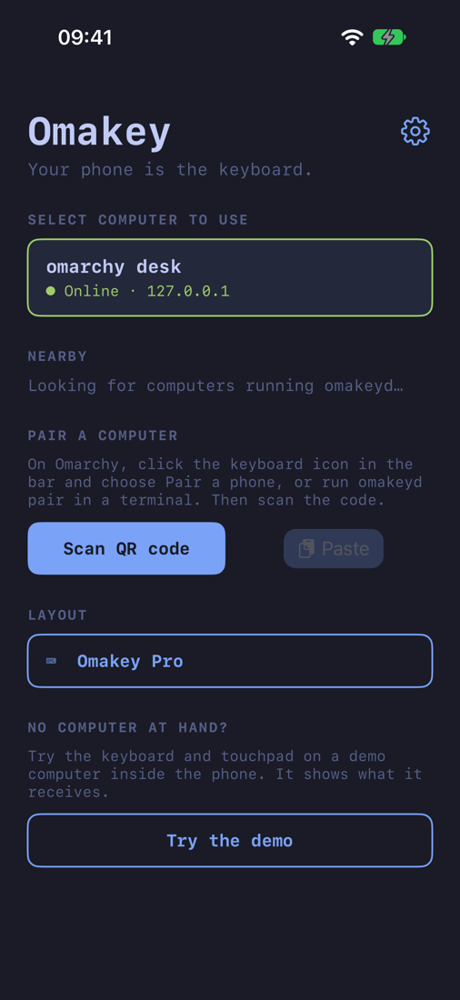
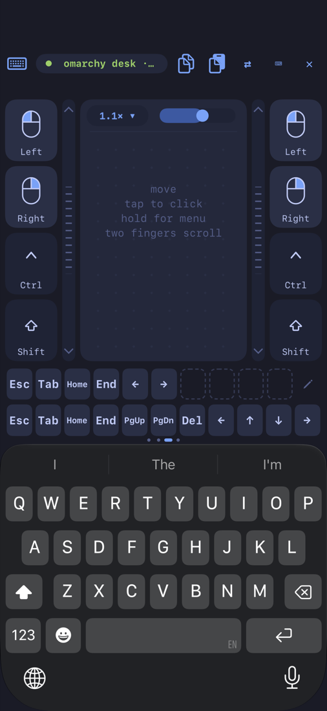
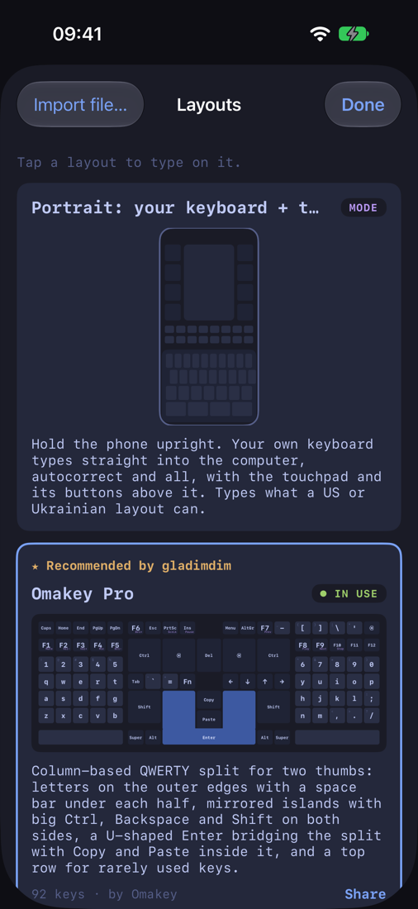
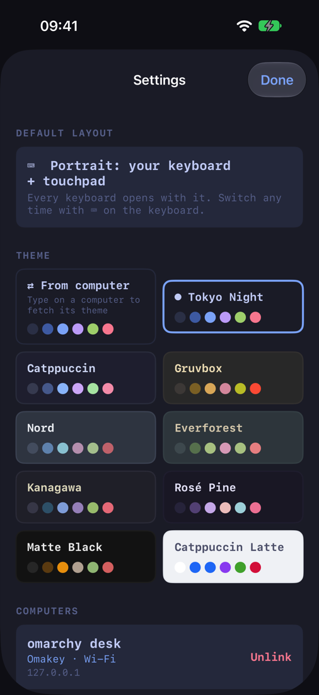

# Omakey for iPhone

Your iPhone as a real keyboard and touchpad for an
[Omarchy](https://omarchy.org/) desktop or a Steam Deck. Every touch
becomes a key press on a kernel-level virtual keyboard made by `omakeyd`,
so Hyprland binds, `SUPER + SPACE`, F-keys, Esc and the lock screen work
as they do with a hardware keyboard. Free and open source (MIT), no
accounts, no cloud.

<p align="center">
  
</p>
<p align="center">
  
</p>
<p align="center">
  
  
  
  
</p>

## What it does

- **Key codes, not text.** Each key goes to the computer as the key it is,
  held as long as your finger is down, so chords like `SUPER + SHIFT + 4`
  and holding a key to repeat work, and the lock screen takes your password.
- **Ten keyboards in the box**, from Omakey Pro (a split layout with big
  thumb keys) to classic QWERTY, Colemak, Dvorak, Corne and Ergodox, with Fn
  layers and sticky modifiers. Import your own from the
  [Layout Studio](https://gladimdim.github.io/omakey-layout-studio/), a file
  or a link.
- **A touchpad** pulled down over the keyboard: tap, two-finger scroll and
  right click, tap-and-drag, side buttons, and a speed you set per computer.
  It answers every touch with a faint buzz.
- **Portrait mode**: hold the phone upright and type with the iPhone's own
  keyboard, autocorrect and all, with the touchpad above it and a
  row of keys you arrange (Esc, Tab, arrows, F-keys, Super).
- **Copy and Paste** between the phone and the computer's clipboard.
- **Themes**, including the computer's own Omarchy theme, and haptics.
- **Pairing by QR code**, with the computer's fingerprint to check; every
  packet is encrypted (AES-256-GCM) with a key only the two of them have.
- **A demo computer** inside the app, to try it without a desktop.

## What you need

- A computer running `omakeyd`: the
  [Omarchy plugin](https://github.com/gladimdim/omakey-omarchy-plugin), or
  its Steam Deck installer. See the
  [website](https://gladimdim.github.io/omakey-omarchy-plugin/#download).
- An iPhone with iOS 17 or newer, on the same network as the computer.
- A Mac with Xcode 27, and an Apple account. A free account is enough for
  your own phone (apps installed that way run for 7 days, then you run it
  from Xcode again); a paid developer account makes it a year.

## Build and install

1. Clone this repository.
2. Create `Config/Local.xcconfig` (git ignores it) with your team id and a
   bundle id of your own:

   ```
   DEVELOPMENT_TEAM = ABCDE12345
   OMAKEY_BUNDLE_ID = com.yourname.omakey
   ```

   Your team id is in Xcode → Settings → Accounts.
3. Open `Omakey.xcodeproj`, choose your iPhone, and run the **Omakey**
   scheme. The first time, the phone asks you to turn on Developer Mode and
   to trust your developer certificate (Settings → General → VPN & Device
   Management).
4. On the computer, click the keyboard icon in the bar → **Pair a phone**
   (or run `omakeyd pair`), and scan the code with **Scan QR code** in the
   app.

## Development

```bash
scripts/check.sh                 # package tests on the Mac + an unsigned device build
scripts/ui-test.sh               # app and UI tests on a simulator, against an omakeyd stand-in
scripts/perf-test.sh             # performance on a connected iPhone (demo computer only)
scripts/screenshots.sh           # the screenshots above, on a simulator
swift run --package-path OmakeyKit omakey-dev-server   # a computer to pair with; types nothing
```

Native Swift with no third-party dependencies: SwiftUI screens, UIKit
multi-touch views, CryptoKit, Network.framework. The protocol, keyboard
logic and networking are a Swift package (`OmakeyKit`) tested on the Mac.
Contributor notes are in [AGENTS.md](AGENTS.md); the plan, the Android
parity tracker, what was validated where, and the performance work are in
[docs](docs).

It's the iPhone counterpart of the Android app, speaking the same
protocol, reading the same layout files and pairing with the same QR code:

| Repository | What |
|---|---|
| [omakey-omarchy-plugin](https://github.com/gladimdim/omakey-omarchy-plugin) | `omakeyd` (the desktop service), the bar widget, and the [wire protocol](https://github.com/gladimdim/omakey-omarchy-plugin/blob/main/docs/PROTOCOL.md) |
| [omakey-mobile](https://github.com/gladimdim/omakey-mobile) | the Android app |
| [omakey-layout-studio](https://gladimdim.github.io/omakey-layout-studio/) | the layout editor and format |

## Not in the iPhone app

- **Bluetooth.** iOS doesn't let apps act as a Bluetooth keyboard, and the
  iPhone app has no Bluetooth link to `omakeyd`: it connects over Wi-Fi.
- **iPad** support is for later.

## Privacy

Omakey collects nothing: no servers, accounts, analytics or advertising.
See [docs/PRIVACY.md](docs/PRIVACY.md).

## License

MIT, see [LICENSE](LICENSE).
