<p align="center">
  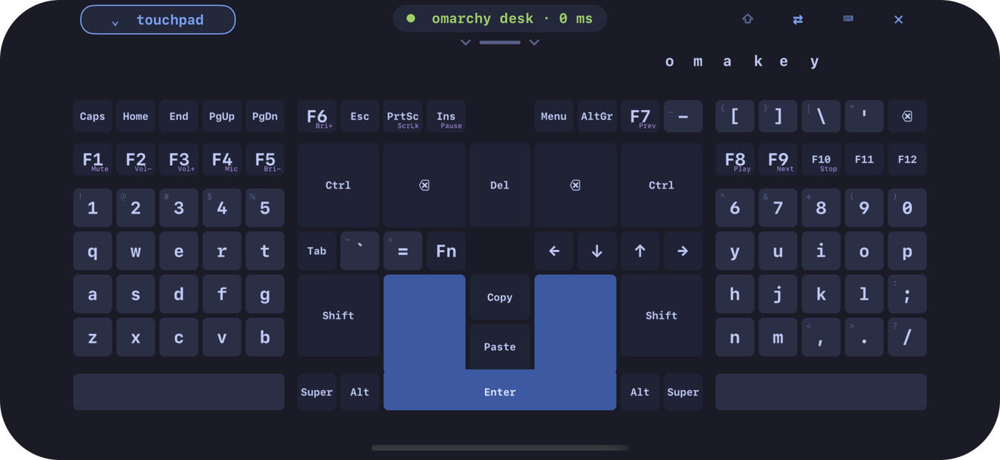
</p>

<h1 align="center">Omakey for iPhone</h1>

<p align="center"><b>Your iPhone is the keyboard. A real one.</b></p>

<p align="center">
  
  
  
  
</p>

<p align="center">
  <a href="https://gladimdim.github.io/omakey-omarchy-plugin/"><b>Omakey website</b></a> ·
  <a href="https://omarchy.dmytrogladkyi.com"><b>Omarchy Works</b></a> ·
  <a href="https://github.com/gladimdim/omakey-omarchy-plugin">omakeyd and the Omarchy plugin</a> ·
  <a href="https://github.com/gladimdim/omakey-mobile">Android app</a> ·
  <a href="https://gladimdim.github.io/omakey-layout-studio/">Layout Studio</a>
</p>

## What this is

**Omakey** turns a phone into a real keyboard and touchpad for
[Omarchy](https://omarchy.org/) Linux and the Steam Deck. On the computer,
`omakeyd` makes a kernel-level virtual keyboard and mouse, so whatever you
press on the phone is a real key press: Hyprland binds like
`SUPER + SPACE`, F-keys, games, even the lock screen. It's a set of free,
open-source apps:

| App | What it is |
|---|---|
| 🖥️ [**omakeyd and the Omarchy plugin**](https://github.com/gladimdim/omakey-omarchy-plugin) | the desktop service, the bar widget, and the Steam Deck installer |
| 🤖 [**Android app**](https://github.com/gladimdim/omakey-mobile) | the original phone app |
| 📱 **iPhone app** | this repository: a native Swift port of the Android app |
| ⌨️ [**Layout Studio**](https://gladimdim.github.io/omakey-layout-studio/) | design your own keyboard layouts, in the browser |

All about Omakey, with downloads and the install command:
**[gladimdim.github.io/omakey-omarchy-plugin](https://gladimdim.github.io/omakey-omarchy-plugin/)**.
More tools for Omarchy by the same author: **[Omarchy Works](https://omarchy.dmytrogladkyi.com)**.

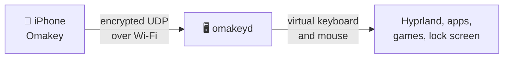

The phone pairs with the computer once by scanning a QR code, and every
packet after that is encrypted (AES-256-GCM) with a key only the two of
them know. No accounts, no cloud, nothing collected.

## Omakey Pro

The layout the app starts with, made for two thumbs on a phone held
sideways: letters on the outer edges with a space bar under each half,
big Ctrl, Backspace and Shift on both sides, a U-shaped Enter with Copy
and Paste inside it, and a top row for the keys you need now and then.
Every finger is its own key, so chords like `SUPER + SHIFT + 4` work, and a
key held down repeats on the computer.

<p align="center">
  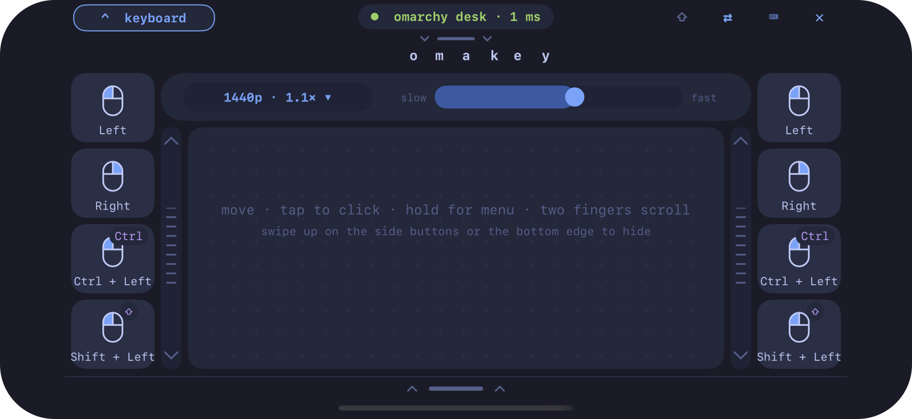
</p>

**Swipe down** and the keyboard becomes a **touchpad**: tap to click, two
fingers to scroll and right-click, tap and drag, side buttons for clicks
and Ctrl or Shift + click, and a pointer speed for each computer. It
answers every touch with a faint buzz.

## Hold it upright: portrait mode

<table>
  <tr>
    <td width="34%">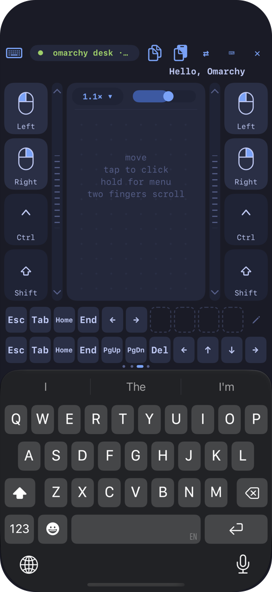</td>
    <td width="34%">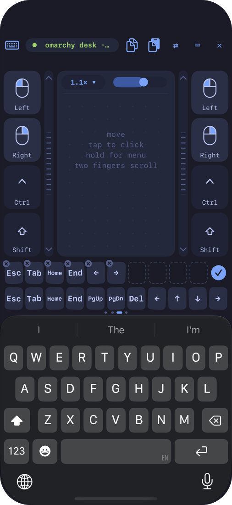</td>
    <td>
      <p>Choose <b>Portrait</b> under Layout and the phone stands up: the touchpad on top, <b>your iPhone's own keyboard</b> below, autocorrect and all. What you type goes straight to the computer, in the US or Ukrainian layout.</p>
      <p>Above the keyboard, the keys it lacks: digits, F1–F12, arrows, Home and End, Super, Ctrl and Alt, media keys, on pages you swipe.</p>
      <p>And a row that's yours: tap the ✏️ pencil, the keys tremble, and you drag the ones you use most up into it.</p>
    </td>
  </tr>
</table>

## Ten keyboards in the box

Split, ergonomic and classic layouts, with Fn layers and sticky modifiers.
Import more from a file, a link, or the
[Layout Studio](https://gladimdim.github.io/omakey-layout-studio/).

<table>
  <tr>
    <td width="50%">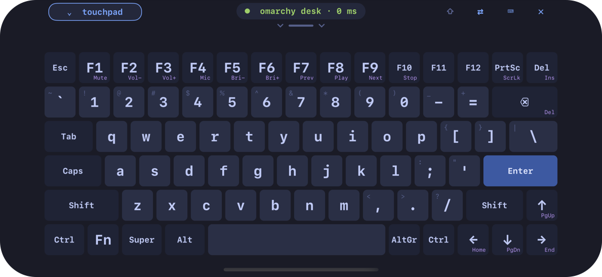<p align="center"><b>Classic QWERTY</b>: laptop-style, with an Fn layer</p></td>
    <td width="50%">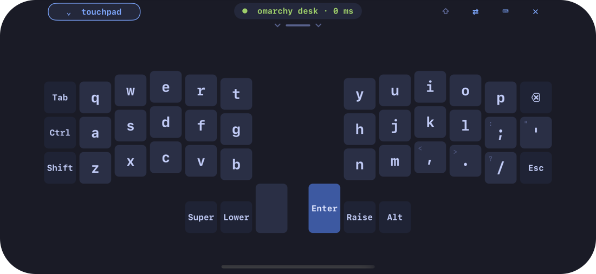<p align="center"><b>Corne</b>: 42 keys, three thumb keys each side</p></td>
  </tr>
  <tr>
    <td>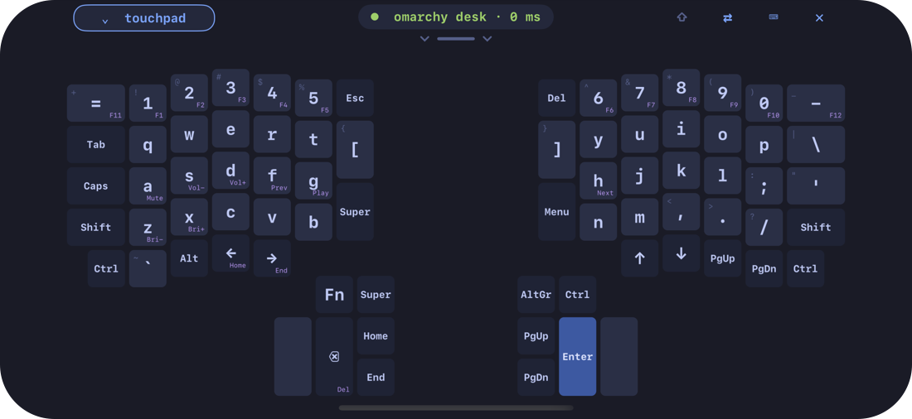<p align="center"><b>ErgoDox</b>: big thumb clusters</p></td>
    <td>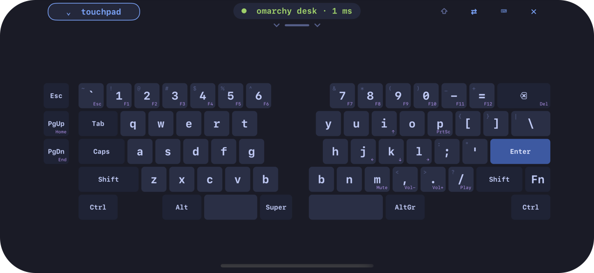<p align="center"><b>Alice</b>: a staggered split with two space bars</p></td>
  </tr>
  <tr>
    <td>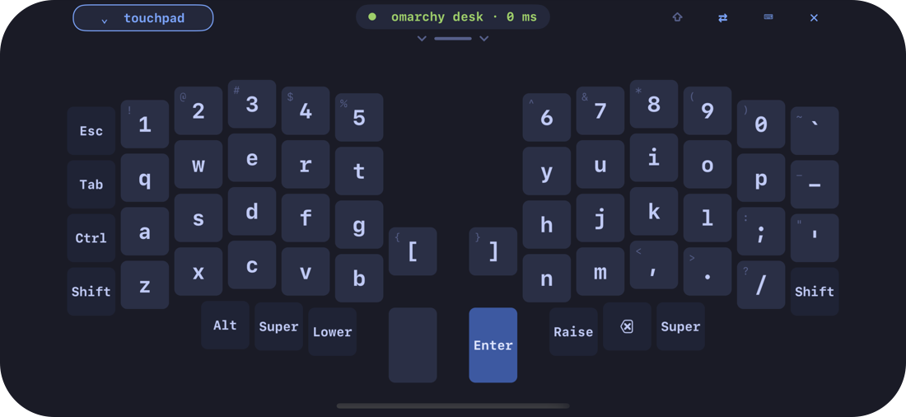<p align="center"><b>Lily58</b>: 58 keys, four thumb keys</p></td>
    <td>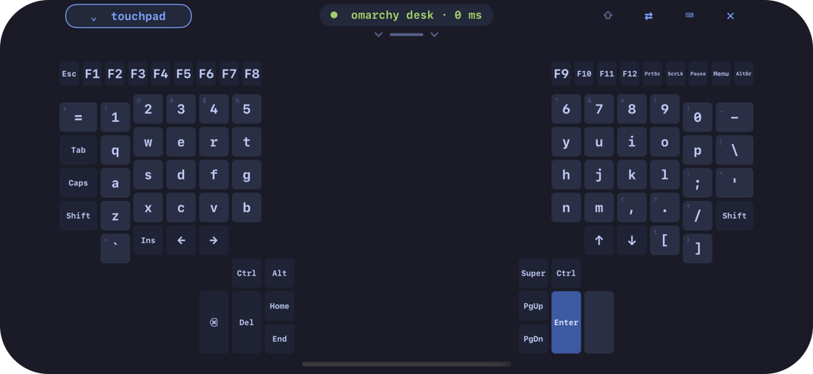<p align="center"><b>Kinesis Advantage</b>, flattened onto glass</p></td>
  </tr>
  <tr>
    <td>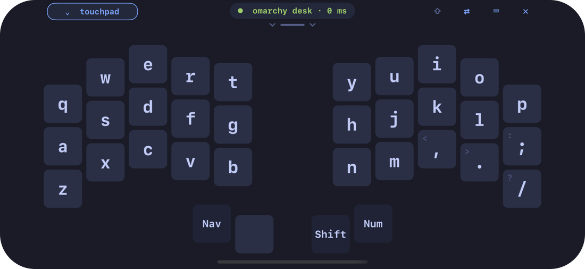<p align="center"><b>Ferris Sweep</b>: 34 keys, nothing else</p></td>
    <td><p align="center"><b>Colemak</b> and <b>Dvorak</b>, with the computer left on US</p></td>
  </tr>
</table>

## Themes

Nine themes from Omarchy, or the one your computer is using right now.

<table>
  <tr>
    <td width="50%">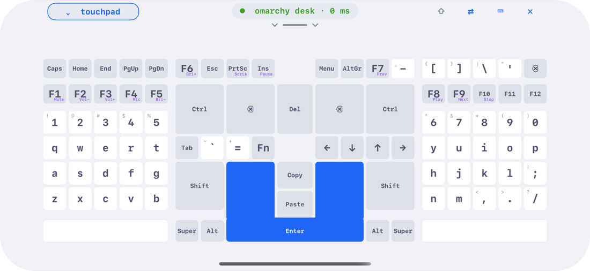<p align="center">Catppuccin Latte</p></td>
    <td width="50%">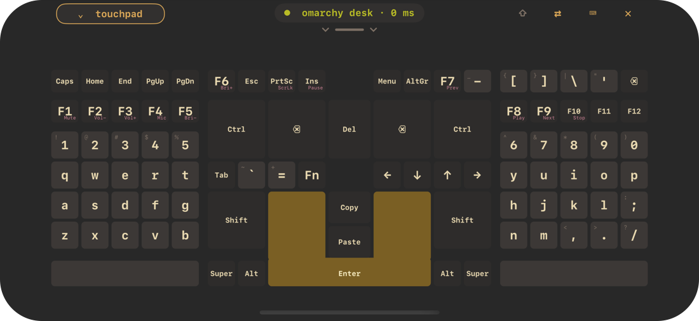<p align="center">Gruvbox</p></td>
  </tr>
  <tr>
    <td>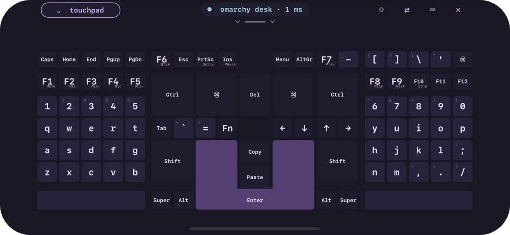<p align="center">Rosé Pine</p></td>
    <td>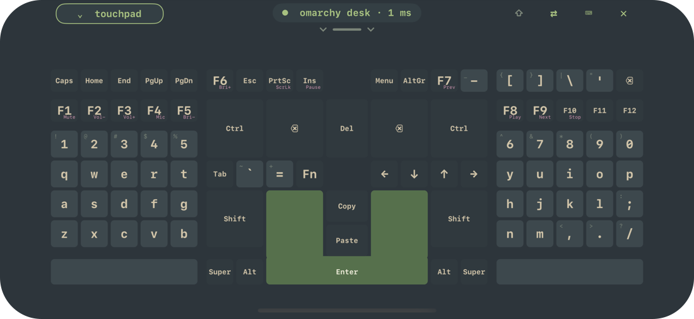<p align="center">Everforest</p></td>
  </tr>
</table>

## Pair, pick, set up

<table>
  <tr>
    <td width="33%">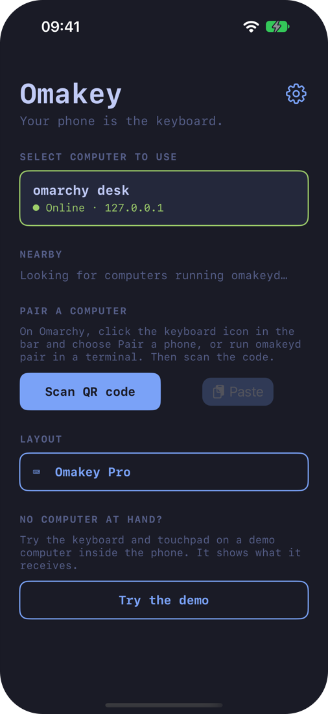<p align="center">Your computers, online or not</p></td>
    <td width="33%">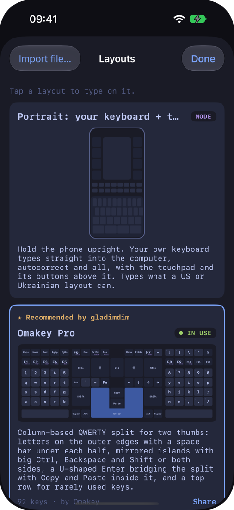<p align="center">Every layout, drawn as it types</p></td>
    <td width="33%">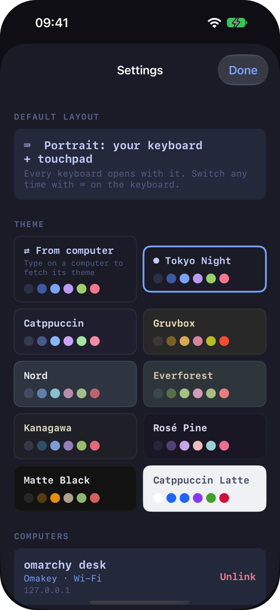<p align="center">Themes, haptics, computers</p></td>
  </tr>
</table>

- 📷 **Pair by QR code** from the bar widget, and check the computer's
  fingerprint before you save it.
- 📋 **Copy and Paste** move text between the phone and the computer.
- 🧪 **No computer at hand?** Tap **Try the demo**: a demo computer inside
  the app shows what it receives.

## Run it in Xcode

### What you need

| You need | |
|---|---|
| A Mac | with **Xcode 27** |
| An iPhone | **iOS 17** or newer (or just the Simulator to try it) |
| An Apple account | a free one is enough for your own phone |
| A computer to type on | **Omarchy** with the [Omakey plugin](https://github.com/gladimdim/omakey-omarchy-plugin), or a **Steam Deck** ([install](https://gladimdim.github.io/omakey-omarchy-plugin/#download)) |

### 1. Get the code

```bash
git clone https://github.com/gladimdim/omakey-mobile-ios.git
cd omakey-mobile-ios
open Omakey.xcodeproj
```

No packages to fetch: the app has no third-party dependencies.

### 2. Try it in the Simulator

Pick the **Omakey** scheme and any iPhone simulator, and press **⌘R**. No
signing needed. Tap **Try the demo** to type on the demo computer, or pair
with a computer on your network by copying its pairing link (`omakeyd
pair` prints it) and tapping **Paste**: the Simulator has no camera.

### 3. Run it on your iPhone

1. Create `Config/Local.xcconfig` (git ignores it) with your team id and
   a bundle id of your own:

   ```
   DEVELOPMENT_TEAM = ABCDE12345
   OMAKEY_BUNDLE_ID = com.yourname.omakey
   ```

   Your team id is in Xcode → **Settings → Accounts** (add your Apple
   account there first).
2. Plug in your iPhone and turn on **Developer Mode** (Settings → Privacy &
   Security → Developer Mode; the phone restarts).
3. Choose your iPhone in Xcode and press **⌘R**.
4. The first time, iOS asks you to trust the developer: Settings → General
   → **VPN & Device Management** → your account → Trust.

With a free account the app runs for 7 days, then press ⌘R again; a paid
developer account makes it a year.

### 4. Pair with your computer

1. On Omarchy, click the keyboard icon in the bar → **Pair a phone** (or run
   `omakeyd pair`). On a Steam Deck, open **Omakey: pair a phone**.
2. In the app, tap **Scan QR code** and point it at the code.
3. Allow **Local Network** when iOS asks: that's how the phone finds and
   reaches the computer.

<details>
<summary><b>Something's not working?</b></summary>

- **"Signing requires a development team"**: `Config/Local.xcconfig` is
  missing, or the team id in it is wrong.
- **"Failed to register bundle identifier"**: someone else has that bundle
  id; pick another `OMAKEY_BUNDLE_ID`.
- **"Untrusted Developer"** when opening the app: trust it as in step 3.4.
- **No computers found**: the phone and the computer must be on the same
  network, and Local Network must be on for Omakey (Settings → Privacy &
  Security → Local Network).

</details>

## Development

```bash
scripts/check.sh                 # package tests on the Mac + an unsigned device build
scripts/ui-test.sh               # app and UI tests on a simulator, against an omakeyd stand-in
scripts/perf-test.sh             # performance on a connected iPhone (demo computer only)
scripts/screenshots.sh           # the screenshots in this README, on a simulator
swift run --package-path OmakeyKit omakey-dev-server   # a computer to pair with; types nothing
```

Native Swift 6: SwiftUI screens, UIKit multi-touch views, CryptoKit and
Network.framework. The protocol, keyboard logic and networking are a Swift
package (`OmakeyKit`) tested on the Mac, and the protocol reproduces the
daemon's test vectors byte for byte. Contributor notes are in
[AGENTS.md](AGENTS.md); the plan, the Android parity tracker, what was
tested where, and the performance work are in [docs](docs).

## Not in the iPhone app

- **Bluetooth.** iOS doesn't let apps act as a Bluetooth keyboard, and the
  iPhone app has no Bluetooth link to `omakeyd`: it connects over Wi-Fi.
- **iPad** support is for later.

## Privacy

Omakey collects nothing: no servers, accounts, analytics or advertising.
See [docs/PRIVACY.md](docs/PRIVACY.md).

## License

MIT, see [LICENSE](LICENSE).
